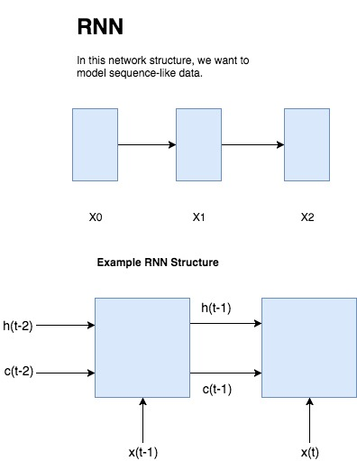

# keras-stock-rnn
Using Keras to build popular RNN structures to predict stock prices.

## Original Blog post source:
https://github.com/lilianweng/stock-rnn Lilian provides a great blog post with code repo based on Tensorflow. It provides a lot useful background readings. Do check it out!

## Structure of the Flow
### Basic Review - Why RNN?

The basic network structure we encounter is 
## Model Buildup

## Experiment Setup

## Conclusion
